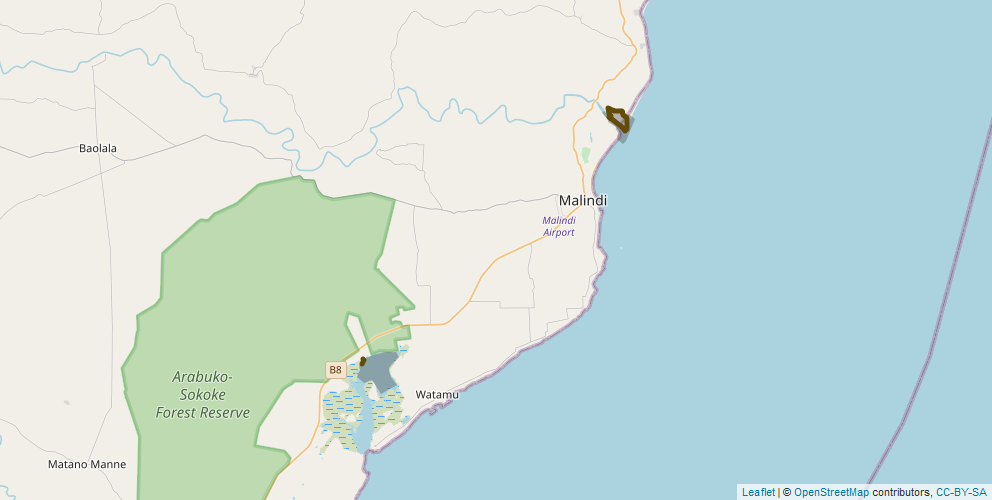

# Waterbird Counts at Sabaki River Mouth and Mida Creek

Raphaël Nussbaumer1,, Kirao Lennox1,, Albert Baya1, Jaap Gijsbertsen1, Andrew Kinzer1,, Colin Jackson 1,

1A Rocha Kenya, Watamu, Kenya

**Corresponding author**: Raphaël Nussbaumer (raphael.nussbaumer@arocha.org)

---

## Description
Since 2000, [A Rocha Kenya](https://www.arocha.or.ke/) has been monitoring waterbirds on a regular basis at two key sites on the coast of Kenya: Sabaki River Mouth ([3°10'03.4"S 40°08'41.7"E](https://goo.gl/maps/RVFBvT526bkHLsTw5)) and Mida Creek ([3°20'07.2"S 39°58'26.4"E](https://goo.gl/maps/dRP9xsPXoa4EhNwp6)).

***Table 1**: Summary of count statistics.*

|                            |Mida Creek  |Sabaki  |
|:--------|:----------|:------|
|Number of surveys (events)  |89          |97      |
|Number of species recorded  |80          |108     |
|Number of observations      |1'848       |3'570   |
|Number of individual seen   |284'573     |409'059 |
 
**Purposes:**
- Monitoring waterbird populations at these two key migratory stopover and non-breeding sites
- Assess short- and long-term trends of wader populations
- Learn about seasonality patterns in arrival and departure dates of migrant waterbirds
- Study the impact of climate change, habitat change, human disturbance

**Type of data**

This dataset is published as a [Darwin Core Archive](https://dwc.tdwg.org/) using a [sampling event dataset](https://www.gbif.org/sampling-event-data) type.

**Data structure**

The metadata and data are generated with [an Rmarkdown file](scripts/generate_gbif_files.html) based on the spreadsheet used to enter data. This script produces two table files: [`events.csv`](data/events.csv) records information related to the overall surveys and [`occurences.csv`](data/occurences.csv) which contains information about individual counts. 

***Table 2**: Events (surveys) table structure*

| type | language | license | rightsHolder | ownerInstitutionCode | eventID | samplingProtocol | sampleSizeValue | sampleSizeUnit | samplingEffort | eventDate | eventTime | locationID | continent | country | countryCode | county | locality | decimalLatitude | decimalLongitude | dynamicProperties | 
| -- | -- | -- | -- | -- | -- | -- | -- | -- | -- | -- | -- | -- | -- | -- | -- | -- | -- | -- | -- |  -- |

***Table 3**: Occurences (counts) table structure*

| basisOfRecord | eventID | occurrenceID | individualCount | taxonID | scientificName | kingdom | phylum | class | takonRank | scientificNameAuthorship | vernacularName | occurrenceRemarks |
| -- | -- | -- | -- | -- | -- | -- | -- | -- | -- | -- | -- | -- |

## Keywords
bird, waterbird, Kenya, coast, count, ornithology, survey, Africa, wetland, estuary, river mouth, creek, East Africa, monitoring, climate, population, trend

## Geographic coverage
Located on the coast of Kenya, Sabaki River Mouth and Mida Creek represent key hotspots for waterbirds, especially for wintering and migrating waders. See section [Study extent](#Study-extent) for more details. 

### Bounding box
The bounding box is **-3.3495° to -3.1522°** latitude and **39.9617° to 40.1525°** longitude.

## Taxonomic coverage
The Ramsar Convention on Wetlands defines waterbirds as any "species of bird that are ecologically dependent on wetlands". This term is further refined in the second edition of Waterfowl Population Estimates (Rose, P.M. and Scott, D.A., 1997), as being all species of the families Gaviidae, Podicipedidae, Pelecanidae, Phalacrocoracidae, Anhingidae, Ardeidae, Balaenicipitidae, Scopidae, Ciconiidae, Threskiornithidae, Phoenicopteridae, Anhimidae, Anatidae, Pedionomidae, Gruidae, Aramidae, Rallidae, Heliornithidae, Eurypygidae, Jacanidae, Rostratulidae, Dromadidae, Haematopodidae, Ibidorhynchidae, Recurvirostridae, Burhinidae, Glareolidae, Charadriidae, Scolopacidae, Thinocoridae, Laridae, Sternidae and Rynchopidae.

Taxa are recorded at the species level with the exception of the Heuglin's Gull (*larus fuscus heuglini*) and Baltic Gull (*Larus fuscus fuscus*). Whenever a bird could not be safely identified at the species level, the identification was done as slash (e.g. Lesser/Greater Sand Plover), genus, family, order or even as *Aves sp.*.

Our dataset contains **107** species and **6** at other taxon levels (subspecies, family, slash etc.) belonging to **22** families.

The `taxonID` used is the species code from the [eBird/Clements Checklist of Birds of the World: v2019](https://www.birds.cornell.edu/clementschecklist/download/).

### Taxonomic ranks

**Kingdom**: *Animalia* (animals)

**Phylum**: *Chordata*

**Class**: *Aves* (birds)

**Families**: *Scolopacidae* (Sandpipers and Allies), *Laridae* (Gulls, Terns and Skimmers), *Charadriidae* (Plovers and Lapwings), *Phoenicopteridae* (Flamingos), *Dromadidae* (Crab-plover), *Anatidae* (Ducks and Geese), *Glareolidae* (Coursers and Pratincoles), *Accipitridae* (Hawks, Vultures, Buzzards, Eagles and Allies), *Threskiornithidae* (Ibises and Spoonbills), *Ardeidae* (Herons, Egrets and Bitterns), *Ciconiidae* (Storks), *Pelecanidae* (Pelicans), *Recurvirostridae* (Stilts and Avocets), *Haematopodidae* (Oystercatchers), *Alcedinidae* (Kingfishers), *Burhinidae* (Thick-knees), *Phalacrocoracidae* (Cormorants), *Pandionidae* (Ospreys), *Rostratulidae* (Painted-snipes), *Balaenicipitidae* (Shoebill), *Jacanidae* (Jacanas), *Rallidae* (Rails, Crakes and Gallinules)

## Temporal coverage
The temporal coverage is **1998-10-29 - 2020-12-09**.

### Content providers

The counts are organized by [A Rocha Kenya](https://www.arocha.or.ke/). 
The (incomplete) list of participants includes: Alasdair Lindop, Albert Baya, Alex Kinzer, Alex Mwalimu, Améline Nussbaumer, Amina Simba, Andrew Kinzer, Andrew McNaughton, Andy Plumptre, Annali Bamber-Jones, Apolloh James, Benjamin Suluby, Benjamin Cowburn, Benji Van Baelenberghe, Beth House, Chege Kariuki, Chris Halliwell, Colin Jackson, Daniel Kazungu, Dave Bruinsma, Dave Guenther, David Ngala, Dena Elijah, Dixon, Dónall Cross, Edwin, Eric Thuranira, Erick Karisa Menza, Fleur Ng'weno, Francis Kazungu, Frank Willems, Freshly Tsofa, Gabe LePage, George Darrah, Harry Mjambili, Hassan Matembe, Hassan Mdogo, Hilary Mwachia, Israel Lemako, Jan Van Beck, Jeff Davis, Jem Harris, Job Aben, John Gitiri, Jonathan Furaha, Joseph Ojuja, Judith Adhiambo, Judith Feldhaus, Juma Badi, Karel De La Cruz Victoria, Kate England, Katie Eshelman, Kibwana Ali, Kirao Lennox, Kirao Mwari, Kristel van Haute-Howes, Laura Sleeman, Lydia Kayaa, Lynton Baird, Marissa, Martilda Munga, Melisa, Michael Kadenge, Monicah Njambi, Mtawali, Mustafa Adamjee, Nancy Cross, Patrick Kaingu, Pauline Kazungu, Peter Musembi, Peter Ndurya, Raphaël Nussbaumer, Rehema, Robin Harris, Roni Jackson, Saddam Kailo, Salim Abdallah, Sam Oldland, Sammy Kenga, Samuel Mweni, Sarah Walker, Simon Valle, Stanley Baya, Tansy Bliss, Ted Nanninga, Timothy Mweri, Willy Kombe.

## Sampling Methods

### Study extent

***Figure 1**: Map showing the path followed during the transect and the area covered for the count in Sabaki River Mouth (North) and Mida Creek (South). This geospatial dataset is available in [this repository](https://github.com/A-Rocha-Kenya/Waterbird-counts-Sabaki-Mida/blob/master/data/locations.geojson) as a geojson file.*

**Sabaki River Mouth** (IBA: [6409](http://datazone.birdlife.org/site/factsheet/6409))

Sabaki River Mouth is where the Athi-Galana-Sabaki river system flows into the Indian Ocean some 5 km north of Malindi. Due to the combined action of ocean currents and freshwater flow from the highlands bringing high levels of silt, a diverse array of habitats have been formed. These include open an sandy beach, sandbanks, mudflats, salt marshes, vegetated and bare sand dunes, seasonal and permanent fresh water pools, mangroves, grassland and coastal scrub. Since the mid-1970s a high level of silt deposition has taken place that has extended the river mouth into the ocean and created the wide, open mud and sand flats which are the key attraction for large numbers of waders. Until c. 2000, there was only some degraded patches of mangrove forest slightly upstream. With the siltation, however, conditions have become ideal for mangroves, and an area of over 12 ha of mangrove forest has grown on the northern banks of the river mouth. Seasonal wetlands form during seasons of good rain on the extension of low sand dunes between the beach and the old, high sand dunes and provide breeding habitat for some birds such as Black-winged Stilts. The sandflats and beach are regularly used as a roost for large numbers of gulls and terns which forage out at sea and come to the relative safety of the river mouth to rest.

A series of high (up to c. 25 m) wind-blown sand dunes extend about 5 km north and 3 km south of the river. These dunes form an important aquifer and as a result among the dunes are pools and wells of fresh water filtered by the sand and separate from the ocean.

"Sabaki" is the name of the final few kilometres of the river that starts in the Ngong Hills west of Nairobi as the Athi River and is known as the Galana River through Ukambani and Tsavo East National Park.

***Figure 2**: Animated map showing the evolution of the Sabaki Delta Estuary from 1984 to 2016.*

***Figure 3**: Animated map showing the evolution of the Sabaki Delta Estuary from 2016 to 2020 with a monthly resolution. [A full resolution video can be found on planet.com](https://www.planet.com/stories/sabaki-river-delta-FIGtYp1MR).*

***Figure 4**: Coverage of the counts performed at Sabaki River Mouth per year and month. The colorscale indicates the number of species recorded in each count.*

**Mida Creek** (IBA: [6406](http://datazone.birdlife.org/site/factsheet/6406))

Mida Creek is a biologically important and complex tidal marine multi-habitat ecosystem supporting the adjacent local communities by providing food, building materials and tourism revenue (Weru et al., 2000). The total intertidal area of this marine inlet is approximately 580 ha.; there is no freshwater surface inflow, only through underground seepage. The majority of the Creek is fringed with a diverse assemblage of mangrove species including *Ceriops tagal, Rhizophora rnucronata, Bruguiera gyrnnorrhiza, Avicennia marina, Sonneratia alba* and *Xylocarpus benadirensis*. The site is disturbed by artisanal fishermen, both for fishing and bait-collecting, and by groups of tourists brought into the creek by boat and on foot from the inland side. Historically disturbance levels have not, however, been high enough to have a major detectable influence on the foraging behaviour of waders (Hockey et al. 1996). The major problems in the creek will be the negative knock-on effects within the ecosystem of over-fishing and exploitation of the marine environment and mangrove forests. Mangrove roots are frequently cut and mud dug up in order to reach fishing bait which clearly destabilises the mangroves and threatens their survival (Jackson 2010, The Birds of Mida Creek).
Mida Creek is an important passage and non-breeding area for Palaearctic migrant waders, with counts of over 8,000 waders. The populations of Greater and Lesser Sand Plover and Crab-plovers here are internationally important.

***Figure 5**: Satellite Image of Mida Creek.*

***Figure 6**: Coverage of the counts performed at Mida Creek per year and month. The colorscale indicates the number of species recorded in each count.*

### Sampling Description
Counts are carried out every month on a date and time with ideal tides (low tide at Sabaki and a Neap high of 2.3m - 2.5m at Mida Creek). The team is composed of a staff member from A Rocha Kenya Science Department, a scribe and usually several volunteers. At Sabaki, the same route is followed on foot along the river bank to the river mouth while in Mida, the counts are performed from a stationary point. Binoculars, telescopes and tally counters are used. The scribe writes in a notebook, listing the species with all the counts announced during the survey and, at the end, he/she tallies the counts and records key metadata (start/end times, area covered, effect of weather on the count, disturbance of bird observed). [A copy of the instructions](data/Notebook_Instruction.pdf) is available. After the count, the staff member enters the count data in an excel spreadsheet, checking the count totals and assigning a count precision.

### Quality control
A rapid quality control has been carried on this dataset but errors are likely to still be present. [Contact us](mailto:raphael.nussbaumer@arocha.org) in case of questions. 

### Step Description
The conversion to the GBIF standard is performed with [a Rmarkdown script](https://a-rocha-kenya.github.io/Waterbird-counts-Sabaki-Mida/scripts/generate_gbif_files).

## Links to other organisations
- [International Waterbird Census](http://iwc.wetlands.org/) (coordinated by [Wetlands International](https://www.wetlands.org/)) 
- [Coordinated Waterbird Counts (CWAC)](http://cwac.birdmap.africa/)
- [The Ramsar Convention on Wetlands](https://www.ramsar.org/), 
- [The Agreement on the Conservation of African-Eurasian Migratory Waterbirds (AEWA)](https://www.unep-aewa.org/)

## External Links
- [Github Repository](https://github.com/A-Rocha-Kenya/Waterbird-counts-Sabaki-Mida)
- [Script to generate the gbif files](https://a-rocha-kenya.github.io/Waterbird-counts-Sabaki-Mida/scripts/generate_gbif_files)
- [Shiny App](https://rafnuss.shinyapps.io/water_bird_count/)
- [ResearchGate Project](https://www.researchgate.net/project/Waterbird-Counts-on-the-Kenya-coast)
- [A Rocha Kenya](https://www.arocha.or.ke/)
- [PowerBi Visual](https://app.powerbi.com/view?r=eyJrIjoiMTFjNmU5MjktZWQ2OS00MWEwLWEzZTEtOTVlYTkxMzk0YjA4IiwidCI6ImE2MzA2MmNiLTI4MmItNDY1MS04NDhmLThjZmM1MTJiNDc4ZiJ9&pageName=ReportSection)

## Power BI visual
<iframe width="800" height="486" src="https://app.powerbi.com/view?r=eyJrIjoiMTFjNmU5MjktZWQ2OS00MWEwLWEzZTEtOTVlYTkxMzk0YjA4IiwidCI6ImE2MzA2MmNiLTI4MmItNDY1MS04NDhmLThjZmM1MTJiNDc4ZiJ9&pageName=ReportSection" frameborder="0" allowFullScreen="true"></iframe>

## References
- England, K. J. H., Jackson, C., & Hockey, P. A. R. (2015). A novel methodology for the rapid assessment of waterbird vulnerability to disturbance. *Ostrich*, **86**(1–2), 75–85. DOI: [10.2989/00306525.2015.1030793](https://doi.org/10.2989/00306525.2015.1030793)
- Fishpool, L. D. C., Evans, M. I., & others. (2001). Important Bird Areas in Africa and associated islands: Priority sites for conservation. *BirdLife International Cambridge.* 
- Harebottle, D. M., Jackson, C. H. W., & Oschadleus, H. D. (2005). Wader ringing in coastal Kenya – results and overview from the first AFRING waterbird ringing course. Wader Study Group Bulletin, 106(April), 55-57. [PDF](https://sora.unm.edu/sites/default/files/15_HarebottledEtAl2005.pdf)
- Hockey, P. A. R., Plagényi, É. E., Turpie, J. K., & Phillips, T. E. (1996). Foraging Beharivous of Crab Plovers Droma Ardeola at Mida Creek, Kenya. *Ostrich*, 67(1), 33–44. [10.1080/00306525.1996.9633778](https://doi.org/10.1080/00306525.1996.9633778)
- Houte-howes, K. S. S. Van. (2005). Macroinvertebrate communities in intertidal mudflats at the Sabaki River Estuary, Kenya: An important habitat for resident and migratory shore birds . Watamu. [PDF](https://www.arocha.or.ke/wp-content/uploads/sites/16/2016/08/7-Macroinvertebrate-communities-in-intertidal-mudflats-Sabaki-River-Mouth-A-Rocha-Kenya.pdf)
- Jackson, C. (2010). The Birds of Mida Creek, Kenya. Watamu. [Researchgate](https://www.researchgate.net/publication/340104737_The_birds_of_Mida_Creek)
- Moragwa, G., Fondo, E., & Okondo, J. (1996). Birds of Mida Creek (Vol. 26). [Link](http://hdl.handle.net/1834/8344)
- Nasirwa, O., Oyugi, J., Jackson, C., Lens, L., Bennun, L., & Seys, J. (1995). Surveys of waterbirds in Kenya, 1995: Lake Victoria wetlands, south Kenya coast and Tana River dams. *Centre for Biodiversity Research Reports: Ornithology*. DOI:[10.14284/175](https://doi.org/10.14284/175)
- Nussbaumer, R., Lennox, K., & Jackson, C. (2020). National Waterbird Counts Report Kenya , Coast. DOI:[10.13140/RG.2.2.36630.57925](https://doi.org/10.13140/RG.2.2.36630.57925)
- Otieno, N. E., Oyieke, H., Ogoma, M., & Kochey, J. (2011). Bird assemblage patterns in relation to anthropogenic habitat modification around an East African estuary. *Western Indian Ocean Journal of Marine Science*, **10**(2), 191-200–200. DOI:[10.2989/00306525.2012.680262](https://doi.org/10.2989/00306525.2012.680262)
- Pearson, D. J., & Serra, L. (2002). Biometrics, moult and migration of Grey Plovers *Pluvialis squatarola*, at Mida Creek, Kenya. *Ostrich*, 73(3–4), 143–146. DOI: [10.1080/00306525.2002.11446744](https://doi.org/10.1080/00306525.2002.11446744)
- Rose, P.M., Scott, D.A. Waterfowl population estimates. *Publication 44*. Wetl. Int. Wageningen, Netherlands 1997.
- Seys, J., Moragwa, G., Boera, P., & Ngoa, M. (1995). Distribution and abundance of birds in tidal creeks and estuaries of the Kenyan coast between the Sabaki River and Gazi Bay. *Scopus: Journal of East African Ornithology*, **19**, 47–60. [PDF](http://www.vliz.be/imisdocs/publications/ocrd/242054.pdf)
- Valle, S., Boitani, L., & Maclean, I. M. D. (2012). Seasonal changes in abundances of waterbirds at Sabaki River Mouth (Malindi, Kenya), a key stopover site on the West Asian-East African Flyway. *Ostrich*, **83**(1), 19–26. DOI: [10.2989/00306525.2012.680262](https://doi.org/10.2989/00306525.2012.680262)

